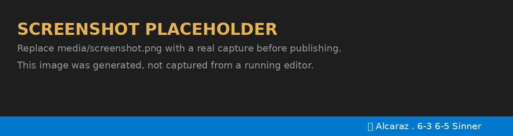

# Live Tennis Scores

Live tennis scores in your VS Code status bar — ATP, WTA, Challenger, ITF and juniors.

```
🎾 Alcaraz • 6-3 6-5 Sinner
```

The `•` marks the player serving. Click the item to pick a different match and pin it.



> **Screenshot placeholder** — `media/screenshot.png` is not yet captured. Replace it before
> publishing to the Marketplace.

## Features

- **Status bar score** for the current live match, refreshed on a timer.
- **Match picker** — click the status bar item for a QuickPick of every live match; selecting one
  pins it. The picker is served from the last refresh, so browsing costs no API quota.
- **Pin follows reality** — when a pinned match finishes and drops off the live list, the status
  bar falls back to the top match rather than going blank.
- **Honest failure states** — a rejected key, a rate limit, or an unreachable API each say what
  happened instead of silently showing a stale score.

## Setup

1. Get a free API key: <https://livetennisapi.com/subscribe/free>
2. Run **Live Tennis: Set API Key** from the Command Palette and paste it.

The key is stored in VS Code's encrypted [SecretStorage][secrets] — not in `settings.json`.

[secrets]: https://code.visualstudio.com/api/references/vscode-api#SecretStorage

## Commands

| Command | What it does |
| --- | --- |
| `Live Tennis: Show Matches` | QuickPick of live matches; pick one to pin it |
| `Live Tennis: Set API Key` | Store or replace the key in SecretStorage |
| `Live Tennis: Refresh` | Fetch now, and clear a halted state after a rejected key |

## Settings

| Setting | Default | Notes |
| --- | --- | --- |
| `livetennis.enabled` | `true` | Hides the item and stops polling when off |
| `livetennis.tour` | `all` | `all`, `atp`, `wta`, `challenger`, `itf`, `juniors` |
| `livetennis.pollIntervalSeconds` | `60` | Floor of 60; lower values are clamped up |
| `livetennis.apiKey` | `""` | **Migration only** — see below |

`tour` defaults to `all` rather than a single tour on purpose: pinned to one tour, the status bar
reads "No live matches" for most of the day.

### Why the poll floor is 60 seconds

The free tier allows **30 requests per minute**, counted **per key** once you are authenticated — so
every editor window and script sharing one key draws on the same budget. (Unauthenticated requests
fall back to a separate per-IP bucket.) At 60s one editor window costs one request per minute.
Values below 60 are clamped up to 60 in code, not merely warned about in the settings UI. On HTTP
429 the extension waits for the `Retry-After` the API sends and never polls faster than it asks.

`Retry-After` is present on *every* response from this API, including `200`s — it reports the
seconds left in the current window, not that you were limited. Only an HTTP 429 means that.

### The `apiKey` setting, honestly

`livetennis.apiKey` exists only so a key can be *provisioned* from a dotfile or devcontainer. It is
not where the key is kept. On the next activation the extension moves the value into SecretStorage,
clears the setting at every scope that held it, and warns you.

Keeping a key in `settings.json` is a genuinely bad idea: that file is replicated by Settings Sync,
is often committed to a dotfiles repo, and is what people paste into bug reports. If you ever put a
real key there, treat it as exposed and rotate it. Prefer **Live Tennis: Set API Key**.

## What this extension shows

Scores and match state: players, games per set, sets, current points, server, tournament, round and
surface. That is what the free tier serves.

## Development

```bash
npm install
npm run typecheck    # tsc --noEmit; esbuild does the emit
npm run compile      # bundle to dist/extension.js
npx @vscode/vsce package
```

Press <kbd>F5</kbd> in VS Code to launch an Extension Development Host.

Built on the official [`livetennisapi`](https://www.npmjs.com/package/livetennisapi) client, which
provides the transport, retry policy and typed errors.

## License

MIT — see [LICENSE](LICENSE).
